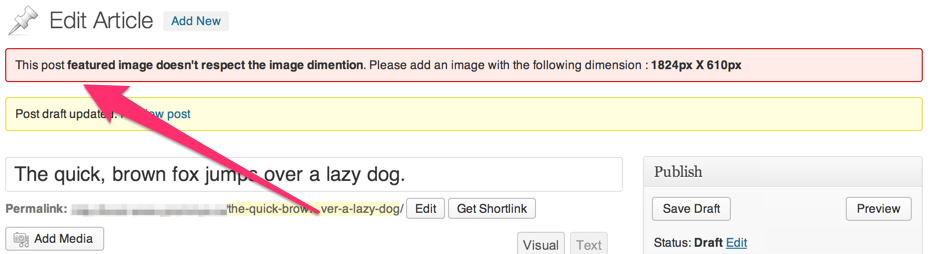

<!-- DO NOT EDIT THIS FILE; it is auto-generated from readme.txt -->
# Force Featured Image


Ever wanted to force a user to publish a post with a featured image of a certain dimension? Search no more.

**Contributors:** [x-team](http://profiles.wordpress.org/x-team), [jonathanbardo](http://profiles.wordpress.org/jonathanbardo), [westonruter](http://profiles.wordpress.org/westonruter)  
**Tags:** [tinyMCE](http://wordpress.org/plugins/tags/tinyMCE), [admin](http://wordpress.org/plugins/tags/admin), [image](http://wordpress.org/plugins/tags/image), [featured-image](http://wordpress.org/plugins/tags/featured-image), [featured](http://wordpress.org/plugins/tags/featured)  
**Requires at least:** 3.5  
**Tested up to:** 3.7.1  
**Stable tag:** trunk (master)  
**License:** [GPLv2 or later](http://www.gnu.org/licenses/gpl-2.0.html)  

## Description ##

**Development of this plugin is done [on GitHub](https://github.com/x-team/mentionable). Pull requests welcome. Please see [issues](https://github.com/x-team/mentionable/issues) reported there before going to the plugin forum.**

## Installation ##

1. Upload `force-featured-image` to the `/wp-content/plugins/` directory
1. Activate the plugin through the 'Plugins' menu in WordPress
1. This plugin lets you specify which post-type requires to force a featured image to. It will also let you specify minimum dimensions for the image.
Let's say, for example, you want to force a user to set an image on the default post type with the following dimensions (400px * 400px). Put this code in the function.php of your theme :

```php
	function theme_force_featured_image( $options ){
		$options['post'] = array(
			'width'  => 400,
			'height' => 400,
		);

		return $options;
	}
	add_filter( 'force_featured_image_post_type', 'theme_force_featured_image' );
```

## Screenshots ##

### The plugin shows the user a warning when he doesn't respect the image dimension



## Changelog ##

### 0.2.0 ###
* Add the ability to force a featured image with dimensions

### 0.1.0 ###
First Release


